
<h1 align="center">图书大厦图书管理系统的设计与实现</h1>

## 简介
图书大厦图书管理系统：分为管理员和用户角色；主要功能包括用户信息管理、图书分类与信息管理、借阅和归还管理、需求反馈管理及统计分析，提升图书馆运营效率及用户体验。    --计算机毕业设计源码；毕设源码；java毕业设计源码

## 联系方式

<h3 align="center">获取完整代码与数据库文件 + 微信：deepguan QQ: 86050149 QQ群: 783742310</h3>

<h3 align="center">可帮忙远程部署 包运行成功！提供远程部署、修改代码、设计文档指导、代码讲解等服务！</h3>

## 功能介绍（完整见运行截图）
管理员：登录、注册和退出功能是基本功能模块，主要用于身份验证和访问控制。通过用户管理模块，管理员可以添加、修改或删除用户信息，处理借阅申请及管理权限。图书管理是核心功能，涵盖图书信息录入、编辑、归还、续借和删除操作，同时支持分类管理。反馈管理模块允许管理员查看、修改和删除用户反馈，方便进行需求整理与系统优化。此外，系统公告版面及新书动态可由管理员编辑发布，实时传达重要信息。

用户：基本功能包括账户的登录、注册和退出。通过个人中心模块，用户可以查看和编辑个人信息，管理个人借阅记录及历史。用户支持浏览图书列表、详细信息及分类，进行图书的借阅、归还和续借操作，可以根据书名、状态等条件进行查询。需求反馈功能允许用户提交反馈，为系统改进提供有价值的建议。用户能通过平台查看和管理自己的借阅状态，享受便捷的图书查询及续借服务，提高整体使用体验。

## 运行截图
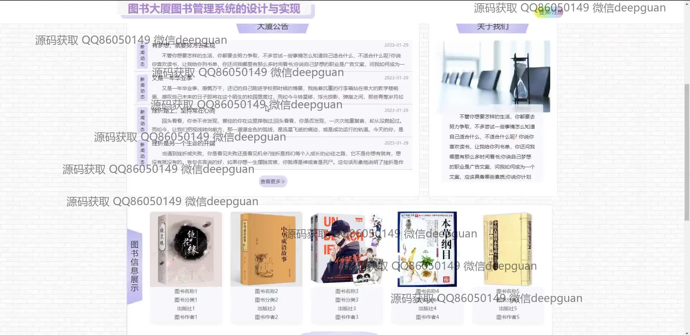
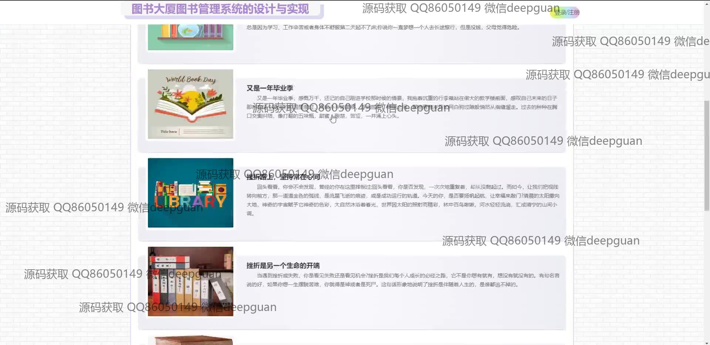
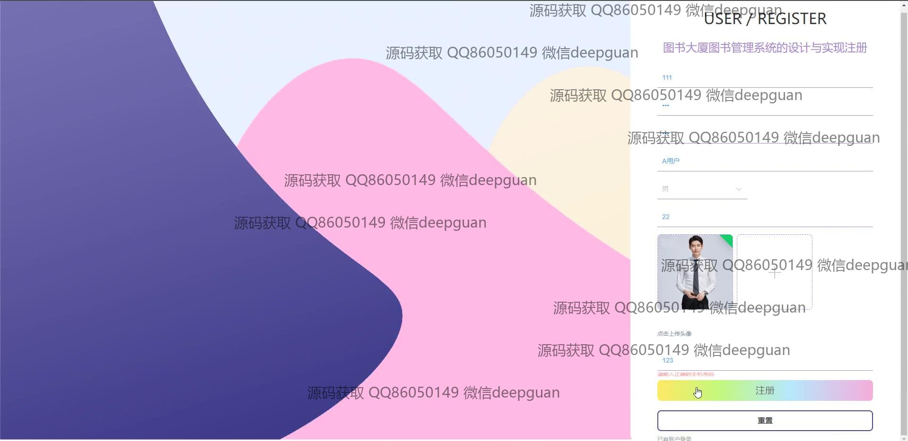
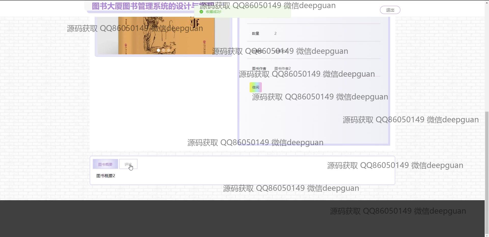

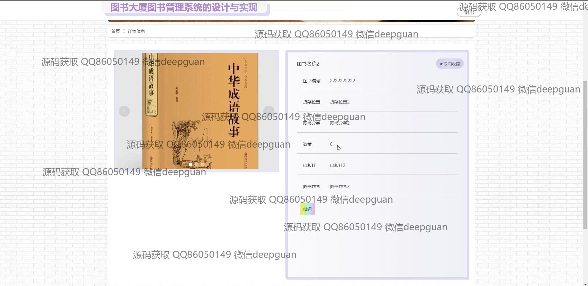

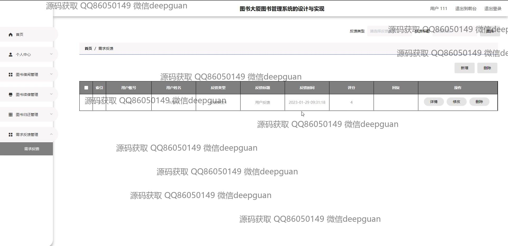

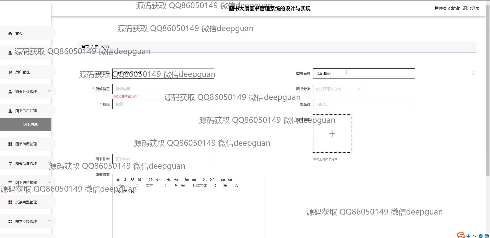
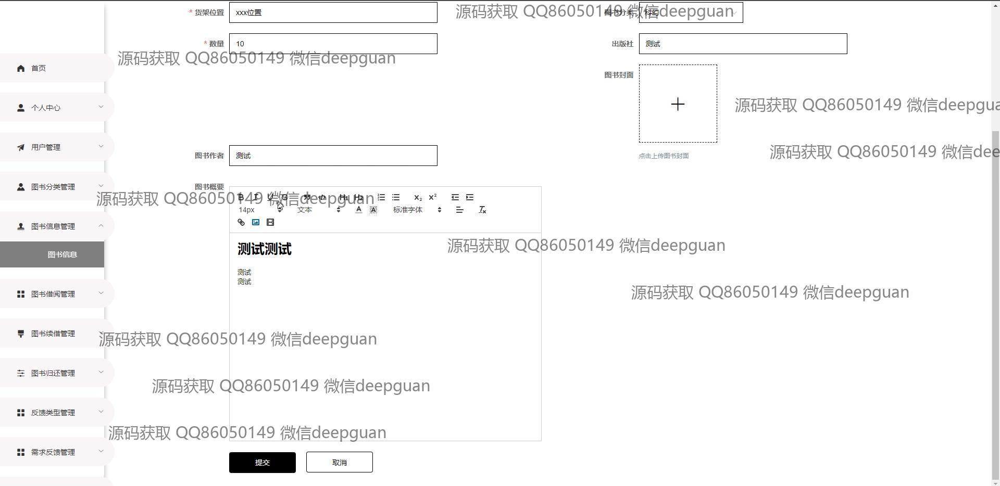
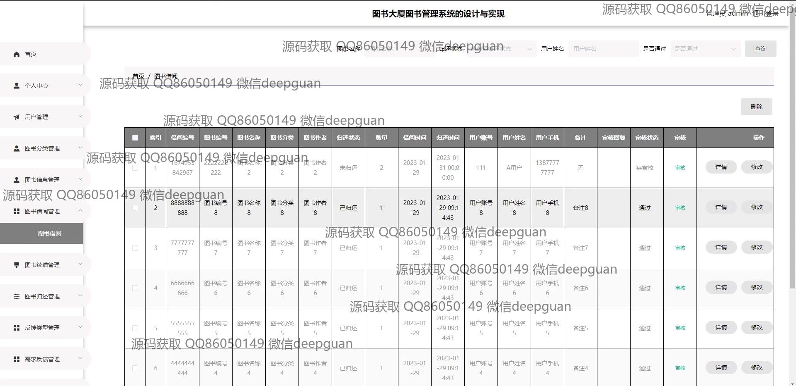
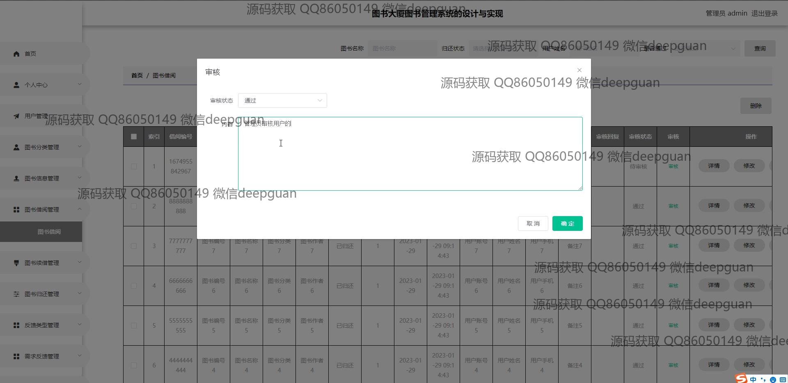
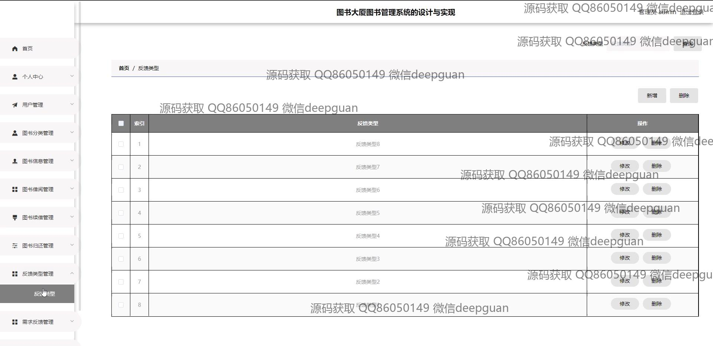
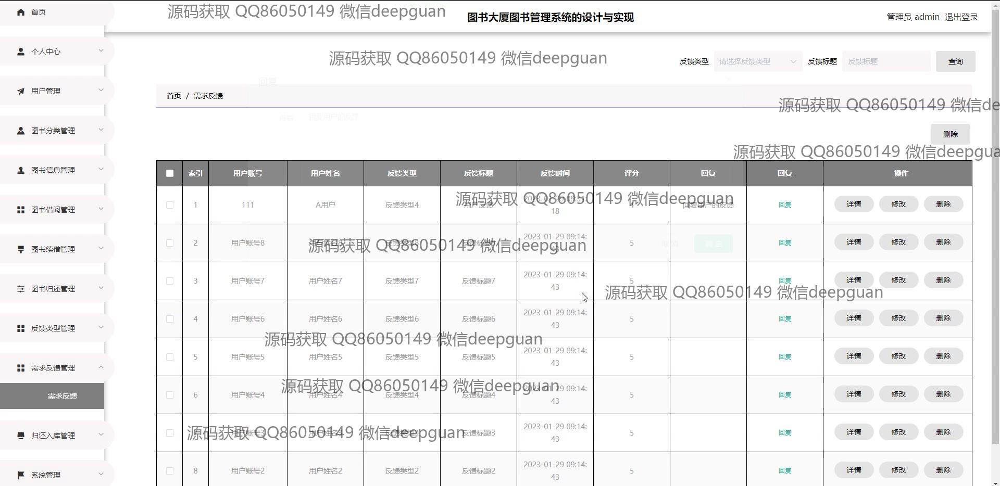
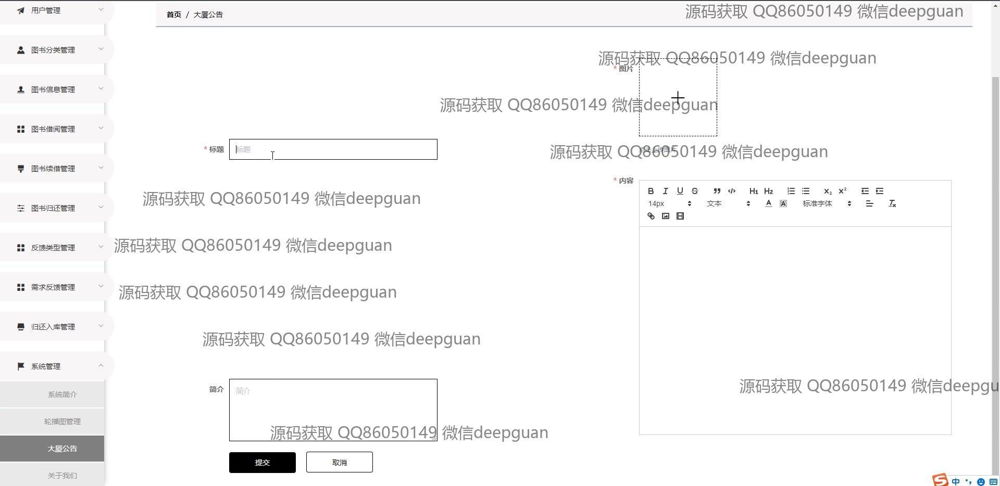
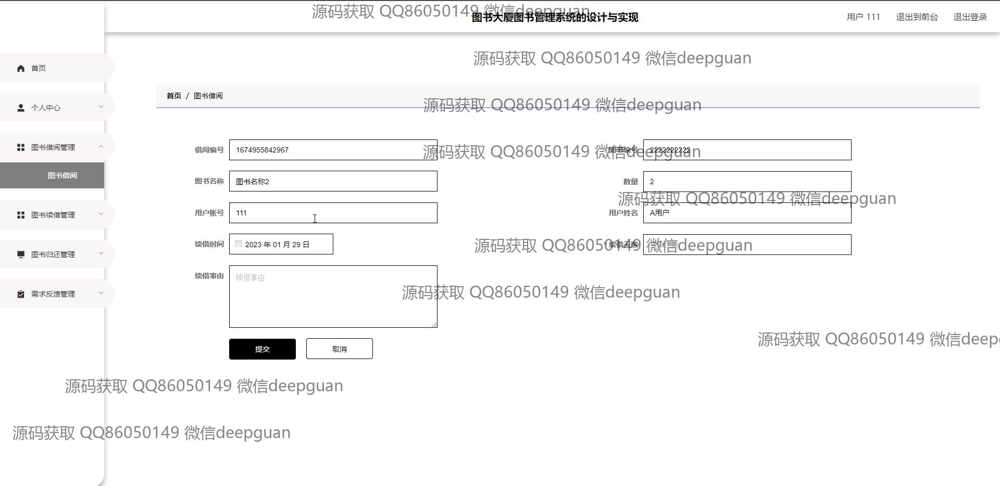
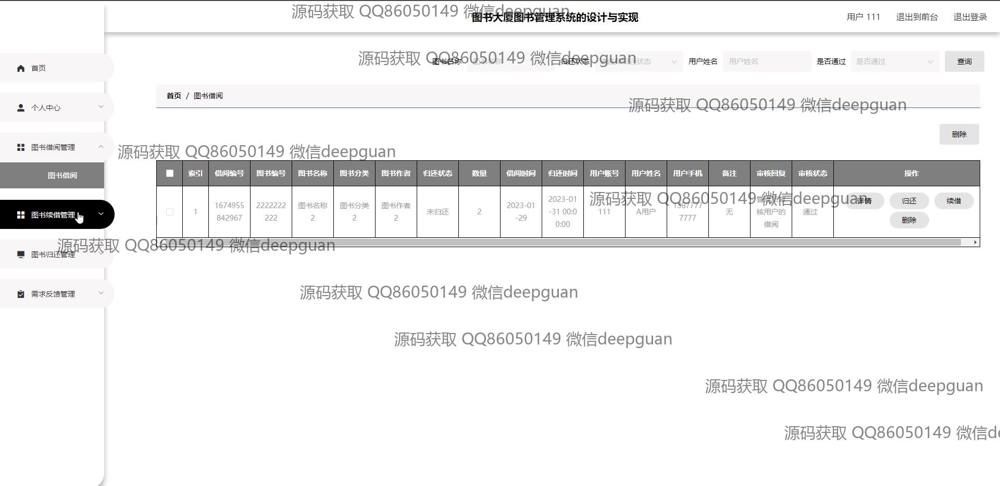
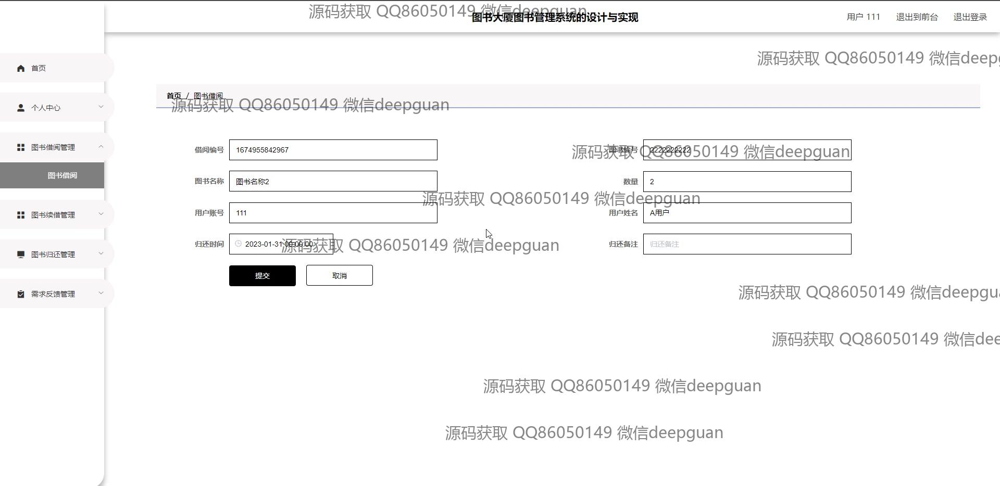
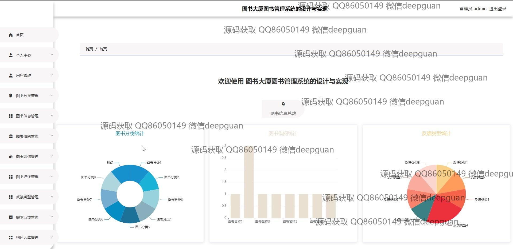
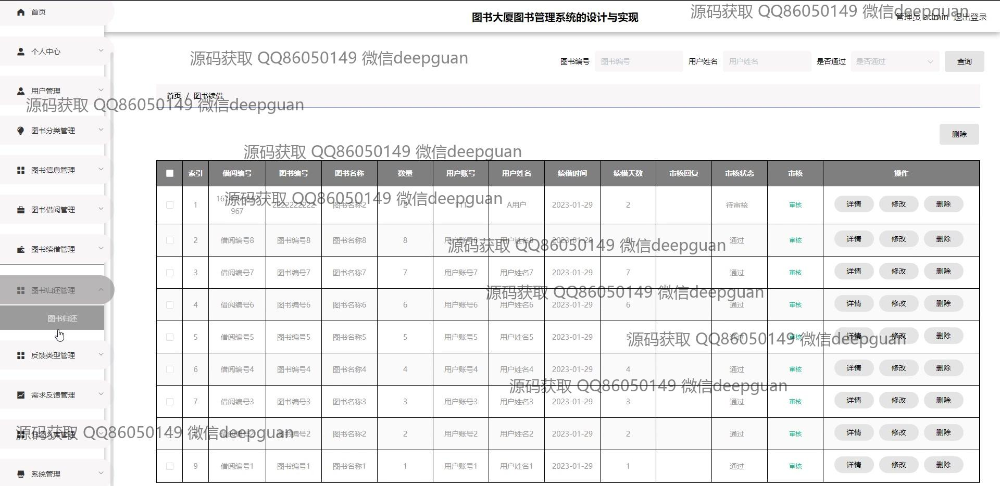
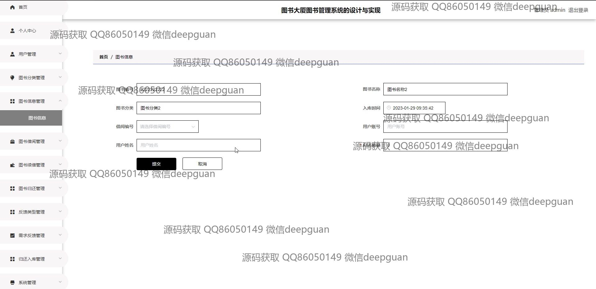
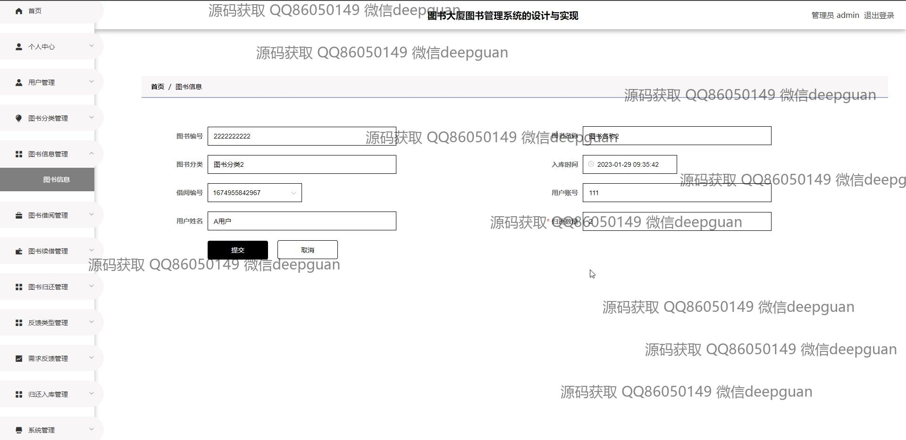
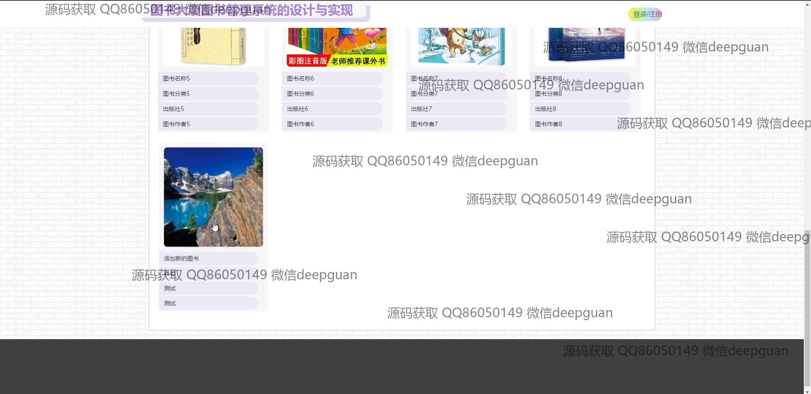

本代码来源于网络,仅供学习参考使用!

